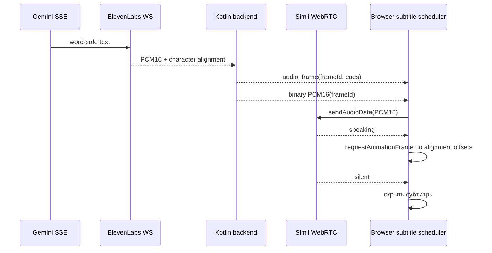

# Синхронные субтитры речи Simli

## Цель и граница

Во время Simli-ответа браузер показывает короткие субтитры только тогда, когда аватар начал фактически озвучивать соответствующий PCM-поток. Текст не должен появляться по Gemini delta и не должен переживать отмену, ошибку или новый turn.

Цель PoC — phrase/word-level отображение с визуальной погрешностью не более одного browser frame после события Simli `speaking`. Это не является доказательством точной синхронизации с удалённым WebRTC audio-device playout: публичный `simli-client` не отдаёт word-level playout timestamps.

Вне scope: второй TTS-запрос ради субтитров, отдельное локальное воспроизведение PCM, распознавание речи, хранение текста в telemetry и изменение D-ID-пути.

## Выбранный источник времени



1. ElevenLabs WebSocket вызывается с `sync_alignment=true`. Для каждого ответа он возвращает PCM и `alignment` с `chars`, `char_start_times_ms`, `char_durations_ms`.
2. Backend преобразует последовательность символов в неизменяемые `SubtitleCue(text, startMs, endMs)` по границам слов и фраз. Начало cue относится к началу PCM timeline текущего turn.
3. Перед каждым binary PCM-кадром backend посылает JSON `audio_frame` с `frameId`, `turnId` и cue. Браузер связывает header с ближайшим следующим binary frame через FIFO; Gemini `delta` может быть между ними и не влияет на сопоставление.
4. Browser накапливает длительность PCM как `pcmBytes / 2 / 16_000`. Когда Simli присылает `speaking`, он фиксирует `playoutZero = performance.now()` и запускает `requestAnimationFrame`. На каждом кадре выбирается cue, чьё окно содержит `performance.now() - playoutZero`.
5. `silent`, cancel, error, disconnect и новый `turnId` немедленно очищают scheduler и DOM. Кадры старого turn игнорируются.

Simli остаётся единственным получателем и воспроизводителем PCM, поэтому движения губ и звук используют один и тот же вход. Локальный `AudioContext` для повторного воспроизведения не используется: он создал бы вторую дорожку и потенциальный lip-sync drift.

## Изменения контракта

### Kotlin domain и TTS

- Заменить `Flow<ByteArray>` в `StreamingTtsClient` на `Flow<TtsAudioFrame>`.
- `TtsAudioFrame` содержит `pcm`, `alignment` и `isFinal`; alignment допускает `null` только как деградированный путь.
- В URL ElevenLabs добавить `sync_alignment=true`; parser принимает документированные `is_final`, `alignment.chars`, `alignment.char_start_times_ms`, `alignment.char_durations_ms`.
- `SubtitleCueBuilder` валидирует длины массивов, объединяет символы в слова и не выдаёт пустые cue. Фразы ограничиваются двумя строками и примерно 42 видимыми символами; длинная фраза дробится только по word boundary.
- При отсутствующем или некорректном alignment PCM продолжает идти в Simli, но cue не создаётся и фиксируется безопасная метрика `subtitle_alignment_missing` без текста.

### WebSocket backend → browser

Добавить к `ChatStreamEvent` только один тип:

```json
{
  "type": "audio_frame",
  "turnId": "UUID",
  "frameId": 17,
  "cues": [{"text": "Короткая фраза", "startMs": 0, "endMs": 680}]
}
```

`audio_frame` всегда создаётся тем же TTS relay, который сразу после него отправляет единственный binary PCM frame. Browser получает header FIFO и применяет к следующему binary frame; несоответствие frameId или turnId — protocol error и очистка очереди. Для одного ответа существует только один producer binary PCM, поэтому порядок устойчив даже при промежуточных Gemini delta.

### Frontend

- В `index.html` добавить семантический region субтитров поверх video: `aria-live="off"`, чтобы screen reader не повторял уже озвученную фразу.
- Вынести чистый `SubtitleScheduler` в отдельный ES-модуль. Его входы: `acceptAudioFrame`, `markSpeaking`, `markSilent`, `reset`; зависимости `now` и `requestAnimationFrame` внедряются в unit-тестах.
- В `simli-stream-client.js` добавить callback `onAudioFrame`, очередь header-ов и callback `onPcm(frameMetadata, pcm)`; PCM продолжает идти в `simliClient.sendAudioData` в прежнем порядке.
- В `app.js` передавать PCM в Simli, затем регистрировать duration/cue в scheduler. Отрисовка начинается только после `simliClient.on("speaking")`; `silent` и текущая cancel-логика вызывают `scheduler.reset(turnId)`.
- Стили: контрастная полупрозрачная плашка в нижней части avatar video, максимум две строки, без layout shift и без анимации, создающей задержку.

## Измерения и критерии

Только числовые telemetry-события без текста:

- `subtitle_frame_received`, `subtitle_first_visible`, `subtitle_last_hidden`;
- `subtitle_alignment_missing`, `subtitle_protocol_error`;
- `simli_speaking_to_subtitle_ms` — proxy: от события Simli `speaking` до первой видимой cue;
- `subtitle_cues_rendered`, `subtitle_dropped_stale`.

`simli_speaking_to_subtitle_ms <= 34` мс — техническая цель одного repaint. Это отдельная метрика от текущей `browser_first_pcm → simli_speaking`; обе остаются proxy, пока Simli не предоставит фактические media timestamps. При скрытой вкладке `requestAnimationFrame` может быть приостановлен, поэтому субтитры скрываются и не считаются нарушением realtime SLO.

## Проверки

1. Kotlin unit: корректный `alignment` → cue; несовпадающие массивы, пустой текст, русский пробел/пунктуация и `is_final`.
2. Kotlin WebSocket test: порядок `audio_frame → binary PCM → done`; отсутствие alignment не блокирует PCM.
3. Frontend unit: cue не видна до `speaking`, меняется по поддельному clock, очищается при `silent`/cancel и игнорирует старый `turnId`.
4. Ручной smoke с реальными ключами: три коротких ответа; записать `simli_speaking_to_subtitle_ms` и подтвердить отсутствие второго audio output.

## Порядок реализации

1. Ввести `TtsAudioFrame`, parser alignment и backend `audio_frame` protocol с Kotlin-тестами.
2. Реализовать frontend scheduler, overlay и JS unit-тесты.
3. Связать метрики, прогнать browser smoke и обновить README с честным ограничением proxy-синхронизации.

## Риски и fallback

- Alignment в ответе ElevenLabs может отсутствовать или быть неполным. Речь и аватар продолжают работу, субтитры безопасно скрываются для соответствующего фрейма.
- Simli `speaking` не является документированным media clock. Если практический drift окажется заметным, следующий исследовательский шаг — analyser удалённого `MediaStream` только для detection audio-energy onset, без локального вывода звука. Это не входит в первый implementation-пакет.
- Новый protocol должен строго проверять `turnId`, иначе отменённые PCM и subtitle frames могут появиться в следующем ответе.
